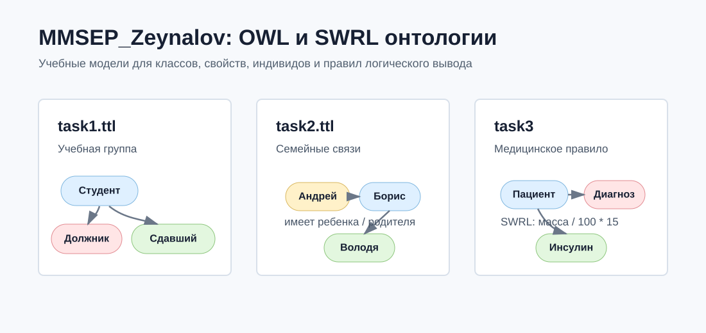
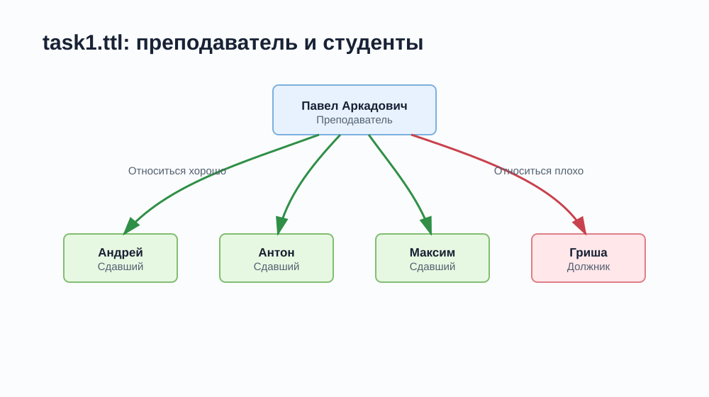
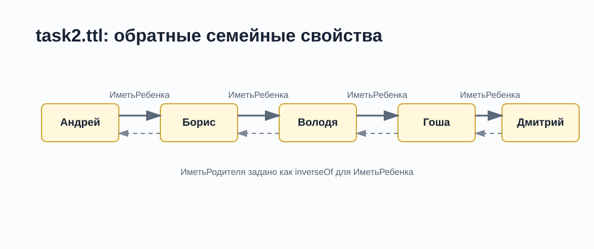
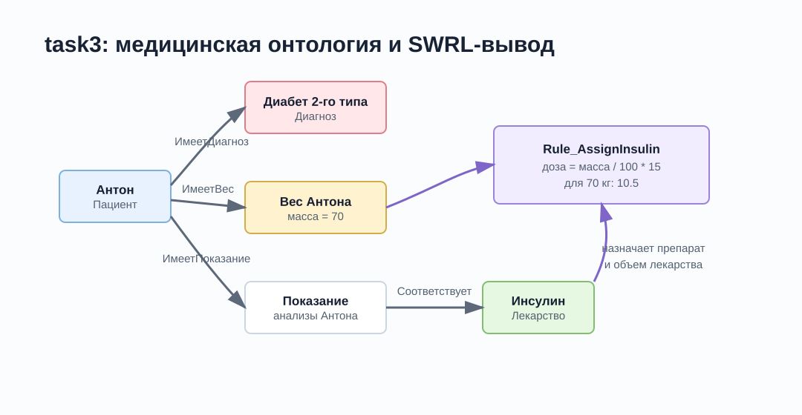
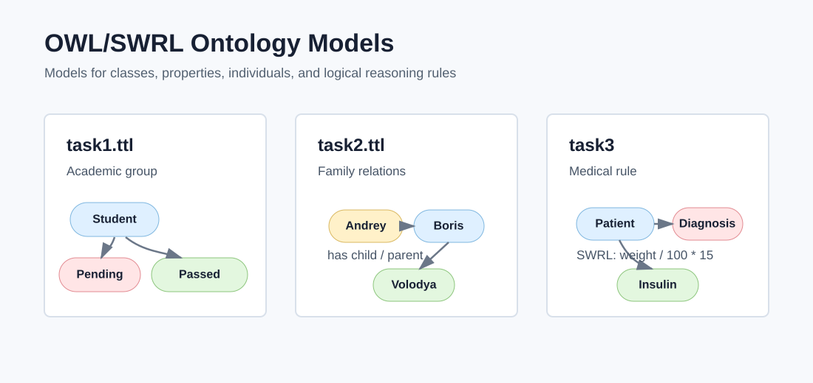
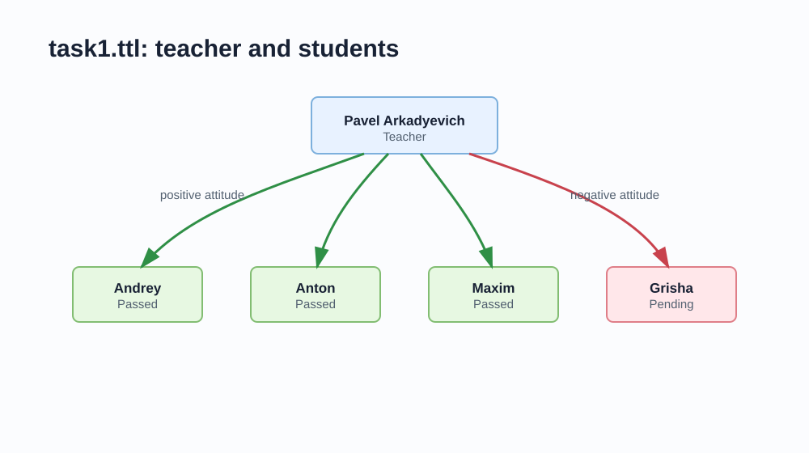
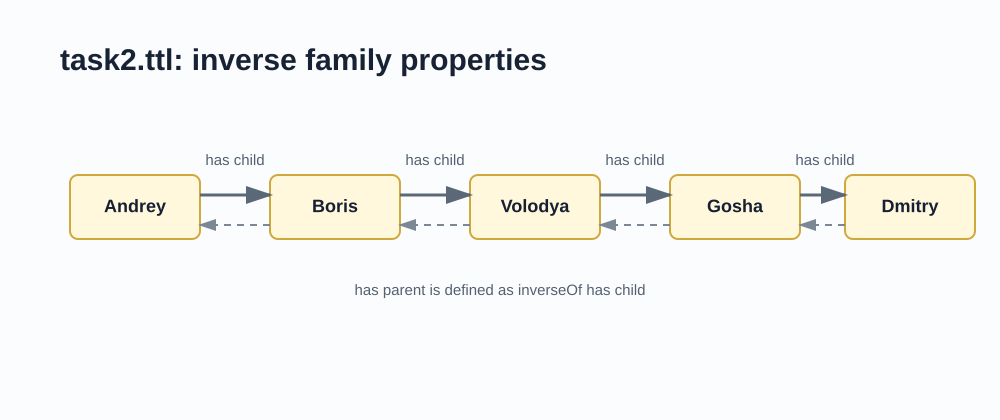
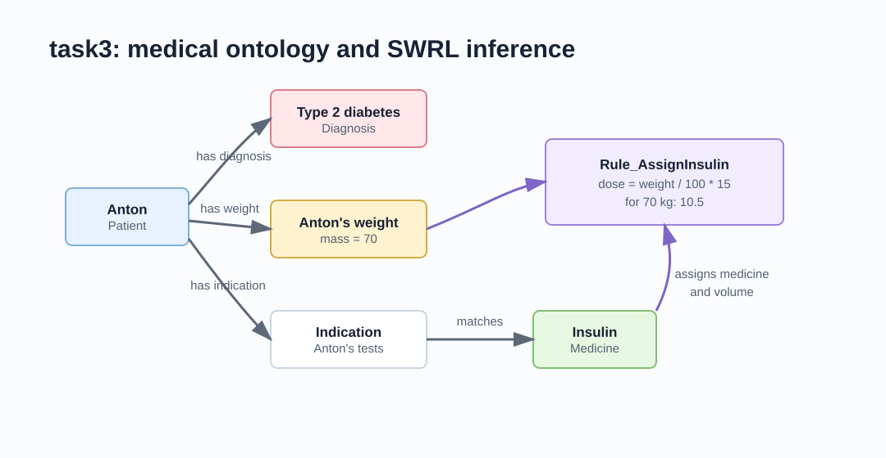

# OWL/SWRL Ontology Models

[English](#ontomonto)

Набор OWL-онтологий в формате Turtle (`.ttl`) с визуальными схемами и SWRL-правилом для моделирования предметных областей и логического вывода.

## Состав репозитория

| Файл | Предметная область | Что моделируется |
| --- | --- | --- |
| `task1.ttl` | Академическая группа | Студенты, преподаватель, должники, сдавшие студенты и отношение преподавателя к студентам |
| `task2.ttl` | Семейные связи | Люди, отношения "имеет ребенка" и "имеет родителя" как обратные свойства |
| `task3/Task31.ttl` | Медицинское назначение | Пациент, диагноз, показания, лекарство, вес и числовой объем лекарства |
| `task3/Task32.ttl` | SWRL-правило | Автоматическое назначение инсулина и расчет дозировки по массе пациента |

## Визуальные схемы

### Модель 1: академическая группа

### Модель 2: родственные связи

### Модель 3: медицинское правило

## Как открыть

1. Установить [Protege](https://protege.stanford.edu/).
2. Открыть нужный `.ttl` файл через `File -> Open`.
3. Для `task3/Task32.ttl` открыть его вместе с `task3/Task31.ttl`, так как правило использует классы и свойства из базовой медицинской онтологии.
4. При необходимости запустить reasoner, например HermiT или Pellet, чтобы проверить выводимые отношения.

## Формат

Все файлы хранятся в UTF-8. Это важно для корректного отображения русскоязычных имен классов, свойств и индивидов.

> **Автор проекта Зейналов У.Р.о.**
---
<h2 id = "ontomonto">
English Version
</h2>

A collection of OWL ontologies in Turtle (`.ttl`) format with visual diagrams and a SWRL rule for domain modeling and logical reasoning.

## Repository Contents

| File | Domain | What it models |
| --- | --- | --- |
| `task1.ttl` | Academic group | Students, teacher, students with pending work, students who passed, and teacher-student attitude relations |
| `task2.ttl` | Family relations | People and inverse "has child" / "has parent" object properties |
| `task3/Task31.ttl` | Medical prescription | Patient, diagnosis, indications, medicine, weight, and numeric medicine volume |
| `task3/Task32.ttl` | SWRL rule | Automatic insulin assignment and dosage calculation based on patient weight |

## Visual Diagrams

### Model 1: academic group

### Model 2: family relations

### Model 3: medical rule

## How to Open

1. Install [Protege](https://protege.stanford.edu/).
2. Open the required `.ttl` file via `File -> Open`.
3. Open `task3/Task32.ttl` together with `task3/Task31.ttl`, because the rule uses classes and properties from the base medical ontology.
4. Run a reasoner such as HermiT or Pellet if you want to check inferred relations.

## Format

All files are stored in UTF-8. This is required for correct rendering of Russian class, property, and individual names.

> **The author of the project : Zeynalov U.R.o.**